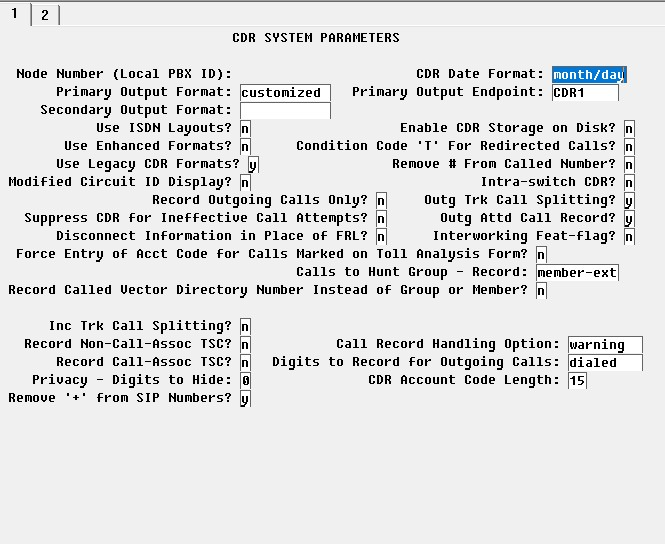
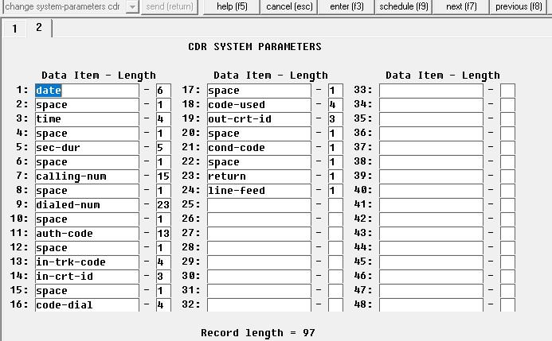

### Сборщик Avaya CDR (логов звонков) с сохранением их в базу данных MySQL.

Пароль на базу данных хранится в linux ***gnome-keyring***
Установить ***gnome-keyring*** можно например так (пример для CentOS и подобных систем)
***yum install gnome-keyring***

Так же необходим python3 и pip
Если pip не установлен его можно поставить например так:
***python3 -m ensurepip --upgrade***
Теперь надо установить библиотеку keyring
***pip3 install keyring***

В случае если при создании пользователя получаете ошибку ***No recommended backend was available***
можно установить следующее:
***pip3 install keyrings.alt***

#### Скрипты управления паролями

**adduser.py** - Добавление пользователя и пароля в keychain.

**deleteuser.py** - Удаление пользователя из keychain.

**getuser.py** - Получение пароля из keychain. (используется avayacdr для получения пароля при запуске)

#### Файл настройки

**params.json** - Необходимо указать адрес сервера MySQL, имя базы данных, имя пользователя
Параметры

| Параметр  | Описание                                                                                |
|-----------|-----------------------------------------------------------------------------------------|
| dburl     | адрес сервера базы данных (IP:порт)                                                     |
| dbname    | имя базы данных и хранилища паролей                                                     |
| dbuser    | имя пользователя базы данных                                                            |
| debugmode | режим отладки (0 выключен, больше 0 включен)                                            |
| smsurl    | адрес сервера отправки SMS о вызове на номер содержащийся в таблице ***smsto***         |
| company   | Название организации (для указания в тексте в SMS)                                      |
| location  | Часовой пояс (например "Europe/Moscow"), если не указан то по умолчанию "Europe/Moscow" |

Пример:

    {"dburl":"127.0.0.1:3306",
     "dbname":"avaya",
     "dbuser":"avaya",
     "debugmode":0,
     "smsurl":"http://127.0.0.1/sendsms.php",
     "company":"PowerC",
     "location":"Europe/Moscow"
    }

Настройка станции:
change system-parameters cdr
На первой вкладке обязательно укажите формат даты: **month/day** и primary output format **customized**

На второй настройте формат таким образом:

| Data item   | Length |
|-------------|--------|
| Date        | 6      |
| space       | 1      |
| time        | 4      |
| space       | 1      |
| sec-dur     | 5      |
| space       | 1      |
| calling-num | 15     |
| space       | 1      |
| dialed-num  | 23     |
| space       | 1      |
| auth-code   | 13     |
| space       | 1      |
| in-trk-code | 4      |
| in-crt-id   | 3      |
| space       | 1      |
| code-dial   | 4      |
| space       | 1      |
| code-used   | 4      |
| out-crt-id  | 3      |
| space       | 1      |
| cond-code   | 1      |
| space       | 1      |
| return      | 1      |
| line-feed   | 1      |

Итого должно получится 97 символов

Просмотр состояния подключения со стороны станции:
в SAT:
**status cdr-link**

### Установка
    cd /opt
    git clone https://github.com/OlegPowerC/avayacdrparce.git
    cd avayacdrparce
    chmod +x getuser.py
    chmod +x deleteuser.py
    chmod +x adduser.py
### Запуск как systemd сервис

Для безопасности имеет смысл не запускать сервис под пользователем **root**
если вы будете зыполнять сервис по **root** вам это не нужно но и безопастность будет снижена.
Создайте нового пользователя и группу:

    getent group avayacdr || groupadd -r avayacdr
    useradd -m -s /bin/bash -g avayacdr -G avayacdr -d /opt/avayacdr avayacdr
    
В файле **avayacdr.service** укажите созданного пользователя и группу:
    
    User=avayacdr
    Group=avayacdr

Задайте права на директорию **/opt/avayacdrparce**
    
    chown -R avayacdr:avayacdr /opt/avayacdr
    chmod 755 /opt/avayacdr
    chmod 755 /opt/avayacdr/avayacdr
    chmod 755 /opt/avayacdr/adduser.py
    chmod 755 /opt/avayacdr/deleteuser.py
    chmod 700 /opt/avayacdr/getuser.py
    chmod 660 /opt/avayacdr/params.json

Задайте пароль на базу данных в keychain

**./adduser.py -u <имя пользователя> -k <хранилище паролей> -p <пароль>**

В нашем случае хранилище паролей совпадает с именем базы данных
Имя пользователя и имя базы данных должно совпадать с параметрами в **params.json**
Пример:

    su avayacdr
    adduser.py -u avaya -k avaya -p StronkPassavaya12%731a

